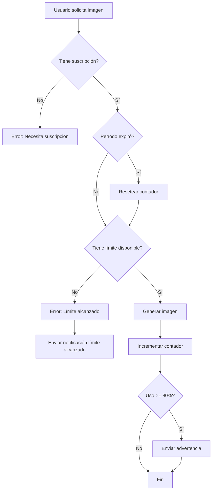

# 🎨 Sistema de Límites de Generación de Imágenes

## 📋 Resumen Ejecutivo

Sistema completo de gestión y control de límites para la generación de imágenes basado en suscripciones, con dashboard administrativo, notificaciones automáticas y estadísticas en tiempo real.

## ✨ Características Implementadas

### 🔐 **Control de Límites**
- ✅ Límites configurables por suscripción
- ✅ Reinicio automático mensual/anual
- ✅ Verificación en tiempo real antes de generar
- ✅ Bloqueo automático al alcanzar el límite

### 📊 **Dashboard de Usuario**
- ✅ Visualización de uso actual
- ✅ Barra de progreso con colores
- ✅ Alertas visuales (80% y 100%)
- ✅ Fecha de reinicio del contador

### 👨‍💼 **Dashboard de Administrador**
- ✅ Estadísticas globales de uso
- ✅ Gestión de límites por suscripción
- ✅ Top 10 usuarios por uso
- ✅ Reset manual de contadores
- ✅ Edición en tiempo real

### 📧 **Sistema de Notificaciones**
- ✅ Email automático al 80% del límite
- ✅ Email automático al 100% del límite
- ✅ Plantillas HTML profesionales
- ✅ Integración con n8n webhook

## 🗂️ Estructura del Proyecto

```
quantum/
├── server/
│   ├── api/
│   │   ├── dashboard/
│   │   │   ├── image-stats.get.ts                    # Estadísticas globales (Admin)
│   │   │   ├── subscription/
│   │   │   │   └── [id]/
│   │   │   │       └── image-limit.patch.ts          # Actualizar límite
│   │   │   └── user/
│   │   │       └── [id]/
│   │   │           └── reset-image-count.post.ts     # Reset contador
│   │   └── user/
│   │       └── image-stats.get.ts                     # Estadísticas usuario
│   └── utils/
│       ├── imageLimit.ts                              # Lógica de límites
│       ├── imageNotifications.ts                      # Sistema de notificaciones
│       └── tool.ts                                    # Herramienta de generación
├── app/
│   └── pages/
│       ├── dashboard/
│       │   └── image-limits.vue                       # Dashboard Admin
│       └── profile/
│           └── index.vue                              # Perfil con stats
├── prisma/
│   └── schema.prisma                                  # Modelos actualizados
├── shared/
│   └── utils/
│       └── schemas.ts                                 # Validaciones
├── docs/
│   ├── IMAGE_LIMITS.md                                # Doc sistema de límites
│   └── ADMIN_DASHBOARD.md                             # Doc dashboard admin
└── update_image_limits.ts                             # Script de migración
```

## 🚀 Inicio Rápido

### 1. Migrar Base de Datos

```bash
# Generar cliente de Prisma con nuevos campos
npx prisma generate

# Sincronizar con la base de datos
npx prisma db push
```

### 2. Actualizar Suscripciones Existentes

```bash
# Ejecutar script de migración
npx tsx update_image_limits.ts
```

### 3. Configurar Variables de Entorno

```env
# En tu archivo .env
N8N_WEBHOOK=https://tu-n8n-instance.com/webhook/image-limits
PUBLIC_APP_URL=https://tu-app.com
```

### 4. Acceder al Dashboard

**Usuario**: Navega a `/profile` para ver tus estadísticas

**Admin**: Navega a `/dashboard/image-limits` para gestionar límites

## 📊 Modelos de Datos

### User
```prisma
model User {
  // ... campos existentes
  imageGenerationCount    Int      @default(0)
  imageGenerationResetAt  DateTime @default(now())
}
```

### Subscription
```prisma
model Subscription {
  // ... campos existentes
  imageGenerationLimit  Int  @default(0)
}
```

## 🔌 API Endpoints

### Usuario

#### `GET /api/user/image-stats`
Obtiene estadísticas de generación del usuario autenticado.

**Respuesta**:
```json
{
  "hasSubscription": true,
  "subscriptionName": "Pro Plan",
  "interval": "MONTHLY",
  "limit": 50,
  "used": 32,
  "remaining": 18,
  "resetAt": "2025-01-01T00:00:00.000Z"
}
```

### Administrador

#### `GET /api/dashboard/image-stats`
Estadísticas globales de la plataforma.

#### `PATCH /api/dashboard/subscription/[id]/image-limit`
Actualiza el límite de una suscripción.

#### `POST /api/dashboard/user/[id]/reset-image-count`
Resetea el contador de un usuario.

## 💡 Ejemplos de Uso

### Verificar Límites en el Frontend

```typescript
const stats = await $fetch('/api/user/image-stats')

if (!stats.hasSubscription) {
  // Mostrar mensaje: "Necesitas una suscripción"
} else if (stats.remaining === 0) {
  // Mostrar mensaje: "Has alcanzado tu límite"
} else {
  // Permitir generar imagen
  console.log(`Te quedan ${stats.remaining} imágenes`)
}
```

### Crear Suscripción con Límites

```typescript
await prisma.subscription.create({
  data: {
    name: 'Pro Plan',
    price: 29.99,
    interval: 'MONTHLY',
    imageGenerationLimit: 50,
    // ... otros campos
  }
})
```

### Actualizar Límite (Admin)

```typescript
await $fetch(`/api/dashboard/subscription/${subscriptionId}/image-limit`, {
  method: 'PATCH',
  body: { imageGenerationLimit: 100 }
})
```

## 🎨 Interfaz de Usuario

### Dashboard de Usuario (`/profile`)
- Tarjeta de estadísticas de imágenes
- Barra de progreso visual
- Alertas cuando quedan pocas imágenes
- Información de reinicio

### Dashboard de Admin (`/dashboard/image-limits`)
- 5 métricas clave en tarjetas
- Panel de gestión por suscripción
- Top 10 usuarios
- Edición en tiempo real
- Reset manual de contadores

## 📧 Notificaciones

### Advertencia (80%)
Se envía cuando el usuario alcanza el 80% de su límite:
- Email con plantilla HTML
- Estadísticas de uso
- Enlace a planes

### Límite Alcanzado (100%)
Se envía cuando se alcanza el límite:
- Email de bloqueo
- Fecha de reinicio
- Opción de upgrade

## 🔧 Configuración de Límites Recomendados

| Plan | Precio | Límite Mensual | Límite Anual |
|------|--------|----------------|--------------|
| Free | $0 | 0 | 0 |
| Basic | $9.99 | 10 | 120 |
| Pro | $29.99 | 50 | 600 |
| Premium | $49.99 | 100 | 1200 |
| Enterprise | Custom | Ilimitado | Ilimitado |

**Nota**: Para límites ilimitados, usa `-1` o un número muy alto (ej: 999999).

## 🔄 Flujo de Generación



## 📚 Documentación Adicional

- **[IMAGE_LIMITS.md](./docs/IMAGE_LIMITS.md)**: Documentación técnica del sistema de límites
- **[ADMIN_DASHBOARD.md](./docs/ADMIN_DASHBOARD.md)**: Guía completa del dashboard administrativo

## 🧪 Testing

### Probar el Sistema

1. **Crear usuario de prueba** con suscripción
2. **Configurar límite bajo** (ej: 3 imágenes)
3. **Generar imágenes** hasta alcanzar el límite
4. **Verificar notificaciones** al 80% y 100%
5. **Probar reset manual** desde dashboard admin

### Comandos Útiles

```bash
# Ver logs del servidor
npm run dev

# Verificar base de datos
npx prisma studio

# Regenerar cliente Prisma
npx prisma generate
```

## 🐛 Solución de Problemas

### Límites no se aplican
```bash
# Regenerar cliente Prisma
npx prisma generate

# Verificar sincronización
npx prisma db push
```

### Notificaciones no se envían
- Verificar variable `N8N_WEBHOOK` en `.env`
- Revisar logs del servidor
- Confirmar webhook activo en n8n

### Dashboard no carga
- Verificar rol ADMIN del usuario
- Revisar consola del navegador
- Verificar endpoints API

## 🚀 Próximas Mejoras

- [ ] Gráficos históricos de uso
- [ ] Exportar reportes en CSV/PDF
- [ ] Compra de paquetes adicionales de imágenes
- [ ] Predicciones con ML
- [ ] Audit log de acciones administrativas
- [ ] Notificaciones push en navegador
- [ ] Rate limiting por minuto/hora

## 📝 Changelog

### v1.0.0 (2025-12-05)
- ✅ Sistema completo de límites implementado
- ✅ Dashboard de usuario
- ✅ Dashboard de administrador
- ✅ Sistema de notificaciones
- ✅ Documentación completa

## 👥 Soporte

Para preguntas o problemas:
1. Revisar documentación en `/docs`
2. Verificar logs del servidor
3. Contactar al equipo de desarrollo

---

**Desarrollado con ❤️ para Quantum**
